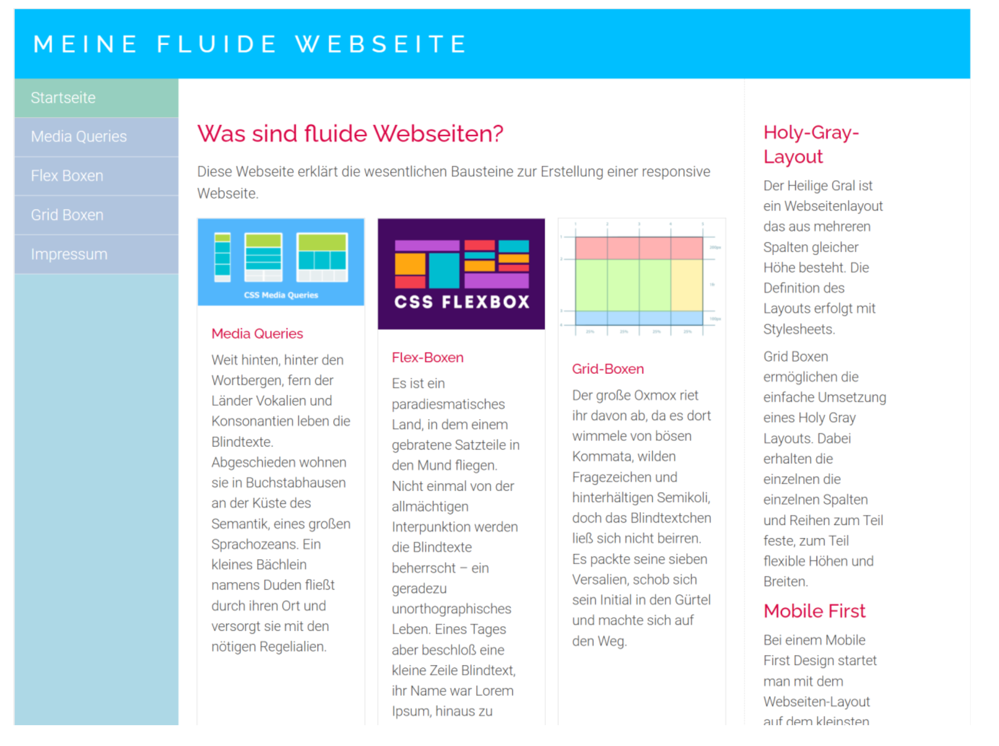

# Labor 4
----
# 1. Erstellen einer flexiblen Web-Seite mit Layout
## 1.2. Flexibler Onepager
#### 3 Sketch
Da ich diese Seite repliziert habe sieht das Layout auf einem großen Billdschirm ungefähr so wie in dem Bild aus. Auf einem kleinen Bildschirm rutscht die Navigationsbar von der Seite ganz nach oben, die Elemente innerhalb der Seite ordnen sich untereinader an und der "aside" Bereich kommt ganz zum Schluss. 



<table>
  <thead>
    <tr>
      <th>Gerätetyp</th>
      <th>Breakpoint</th>
      <th>Layoutanpassung</th>
    </tr>
  </thead>
  <tbody>
    <tr>
      <td>Desktop</td>
      <td>>1024px</td>
      <td>Drei-Spalten-Layout</td>
    </tr>
    <tr>
      <td>Tablet</td>
      <td>768px - 1024px</td>
      <td>Navigation oben, Spalten untereinander
</td>
    </tr>
    <tr>
      <td>Handy</td>
      <td>≤768px</td>
      <td>Alles untereinander, kompakte Navigation</td>
    </tr>
  </tbody>
</table>

#### 4 Definition CSS
<table>
  <thead>
    <tr>
      <th>Bereich</th>
      <th>Farbe</th>
    </tr>
  </thead>
  <tbody>
    <tr>
      <td>Header</td>
      <td>#6cb2eb (Blau)</td>
    </tr>
    <tr>
      <td>Navigation</td>
      <td>#b0c4de (Hellblau)</td>
    </tr>
    <tr>
      <td>Nav-Hover</td>
      <td>#8ca0b3 (Grau-Blau)</td>
    </tr>
    <tr>
      <td>Hauptbereich</td>
      <td>#f4f4f4 (Hellgrau)</td>
    </tr>
    <tr>
      <td>Seitenleiste</td>
      <td>#f8f9fa (sehr helles hellgrau)</td>
    </tr>
    <tr>
      <td>Wichtige Überschriften</td>
      <td>#e63946 (Rot)</td>
    </tr>
  </tbody>
</table>

<table>
  <thead>
    <tr>
      <th>Element</th>
      <th>Schriftart</th>
      <th>Textröße (px)</th>
    </tr>
  </thead>
  <tbody>
    <tr>
      <td>Header</td>
      <td>Arial, sans-serif</td>
      <th>24px (Desktop) / 18px (Mobile)
</th>
    </tr>
    <tr>
      <td>Navigation</td>
      <td>Arial, sans-serif</td>
      <th>18px
</th>
    </tr>
    <tr>
      <td>Hauptseite</td>
      <td>Arial, sans-serif</td>
      <th>16px
</th>
    </tr>
    <tr>
      <td>Asidetext</td>
      <td>Arial, sans-serif</td>
      <th>16px
</th>
    </tr>
    </tr>
  </tbody>
</table>

#### 5 Kompositionsdiagramm
```
Webseite (HTML-Dokument)
├── Header
│   └── <h1> MEINE FLUIDE WEBSEITE </h1> (Titel der Seite)
├── Navigation (Nav)
│   └── <ul> (Ungeordnete Liste)
│       ├── <li> (Navigationseinträge)
│       │   ├── <a href="#startseite">Startseite</a>
│       │   ├── <a href="#media-queries">Media Queries</a>
│       │   ├── <a href="#flex-boxen">Flex Boxen</a>
│       │   ├── <a href="#grid-boxen">Grid Boxen</a>
│       │   └── <a href="#impressum">Impressum</a>
├── Main
│   ├── <section> (Startseite)
│   │   ├── <h2> Was sind fluide Webseiten? </h2>
│   │   └── <p> Beschreibung und Erklärung </p>
│   ├── <section class="content"> (Content-Section)
│   │   ├── <article> 
│   │   │   ├── 
│   │   │   ├── <h3> Media Queries </h3>
│   │   │   └── <p> Erklärung über Media Queries </p>
│   │   ├── <article> 
│   │   │   ├──  
│   │   │   ├── <h3> Flex-Boxen </h3>
│   │   │   └── <p> Erklärung über Flexbox </p>
│   │   └── <article> 
│   │       ├── 
│   │       ├── <h3> Grid-Boxen </h3>
│   │       └── <p> Erklärung über Grid Boxen </p>
│   └── <section> (Impressum)
│       ├── <h2> Impressum </h2>
│       ├── <p> Rechtliche Informationen </p>
│       ├── <p> Verantwortlicher: Max Mustermann </p>
│       ├── <p> Adresse: Musterstraße 1, 12345 Musterstadt </p>
│       └── <p> Kontakt: <a href="mailto:max.mustermann@example.com">max.mustermann@example.com</a></p>
└── Aside
    ├── <h3> Holy-Gray-Layout </h3>
    ├── <p> Erklärung des Holy-Gray-Layouts </p>
    ├── <h3> Mobile First </h3>
    └── <p> Erklärung von Mobile First Design </p>

```
